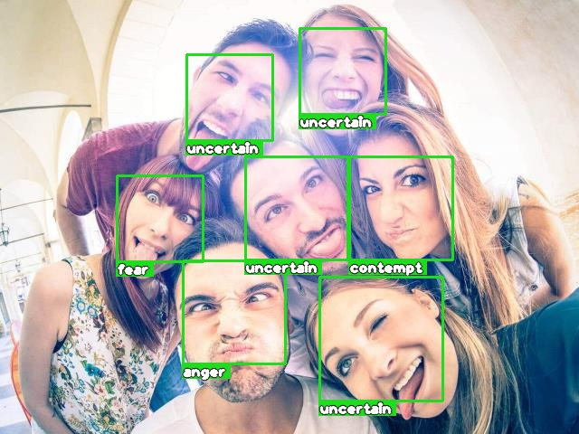
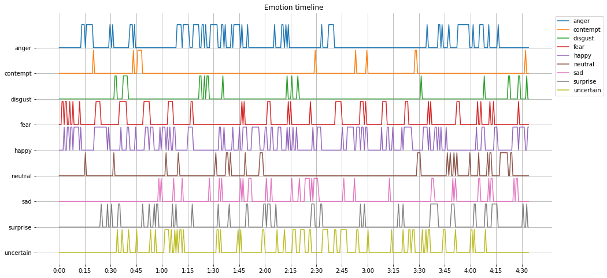

*Дипломная работа*

# Разработка моделей распознавания эмоций на изображении

## Ссылки

1. [youtu.be/PNzgEXyk66s](https://youtu.be/PNzgEXyk66s)
   * Запись выступления на on-line защите (10 минут) + оценка эксперта
1. [docs.google.com/presentation/d/1NhP...FN4I](https://docs.google.com/presentation/d/1NhPAmC92J0V7qJkXm4G2BLtpCZlzJ7NkgOobYGHFN4I/edit?usp=sharing)
   * Презентация в Google Slides
1. [github.com/d-01/graduate-2021-dec/wiki/Задание](https://github.com/d-01/graduate-2021-dec/wiki/Задание)
   * Задание
1. [github.com/d-01/graduate-2021-dec/wiki/Теория](https://github.com/d-01/graduate-2021-dec/wiki/Теория)
   * Теория
1. [github.com/d-01/graduate-2021-dec/wiki/Описание-процесса-разработки](https://github.com/d-01/graduate-2021-dec/wiki/Описание-процесса-разработки)
   * Описание процесса разработки

## Материалы для сдачи

### Модель классификации эмоций

#### Ссылки

1. [Google Colab](https://colab.research.google.com/drive/1N3IJFWkODZLT2IlFsbd75Z9SKlCBCApk?usp=sharing)
1. Копия в формате `*.ipynb`: [16_demo_kaggle_submission_generator.ipynb](16_demo_kaggle_submission_generator.ipynb)
1. Файл [*submission.csv*](submission.csv) для загрузки на kaggle.

#### Содержание

1. Код загрузки тестового датасета.
1. Код загрузки модели для классификации эмоций.
1. Генератор файла *submission.csv*.
1. Тест производительности модели: время инференса и FPS.

#### Инструкция по запуску

* Для запуска необходимо использовать среду Google Colab (рекомендуется) или Jupyter Notebook.
  * При запуске в Jupyter Notebook, возможно, потребуется установить дополнительные зависимости.
* Выполнить все ячейки в ноутбуке (Menu - Runtime - Run all `Ctrl+F9`).
* В процессе работы в текущую директорию будут загружены следующие необходимые для работы скрипта файлы:
  1. `test_kaggle.zip` (220МБ) -- архив с тестовым датасетом
  1. `test_kaggle` (220МБ) -- директория с 5000 тестовых изображений
  1. `saved_model_infr_fer.h5` -- модель в формате HDF5
* По окончании работы скрипта в текущей директории будет создан файл с ответами для загрузки на kaggle:
  * `submission.csv`

### Модель предсказания valence-arousal разложения

#### Ссылки

1. [Google Colab](https://colab.research.google.com/drive/1ibta6cfO7qeVkVUJtbwR_Fn-usF5x-2L?usp=sharing)
1. Копия в формате `*.ipynb`: [10_demo_valence_arousal.ipynb](10_demo_valence_arousal.ipynb)

#### Содержание

1. Демонстрация предсказания valence-arousal с помощью двух предобученных сверточных нейросетей.
1. Тест производительности моделей: время инференса и FPS.

#### Инструкция по запуску

1. Выполнить все ячейки (Run all `Ctrl+F9`).

### Распознавание эмоций на изображении

#### Ссылки

1. [Google Colab](https://colab.research.google.com/drive/1qmD_fJc9KL2pjmWScqWc8aJoXqBiCeFU?usp=sharing)
1. Копия в формате `*.ipynb`: [13_demo_emotion_recognition.ipynb](13_demo_emotion_recognition.ipynb)

#### Содержание

Демонстрация полного пайплайна распознавания лиц на изображении:

1. Детектирование лиц.
1. Определение эмоции с помощью нейросети.
1. Добавление аннотаций в виде бокса (bounding box) и текста.

#### Инструкция по запуску

1. Выполнить все ячейки (Run all `Ctrl+F9`).
1. После выполнения всех ячеек можно заменить тестовые изображения `1.jpg` и `2.jpg` на произвольные и выполнить ячейки начиная с раздела `Demo` (Run after `Ctrl+F10`).

### Распознавание эмоций на видео

#### Ссылки

1. [Google Colab](https://colab.research.google.com/drive/1eoZHZqYJiMV266zEfJ3Vb3EEXQ6xDh0A?usp=sharing)

#### Содержание

1. Демонстрация распознавания эмоций в реальном времени.
2. В качестве видео-потока можно использовать видео-файл или веб-камеру.
   * По-умолчанию используется видео-файл, что не требует наличия веб-камеры для демонстрации работы.

#### Инструкция по запуску

1. (опционально) Для использования веб-камеры убедиться, что веб-браузер имеет доступ к веб-камере (рекомендуется Google Chrome).
1. Открыть ноутбук в [Google Colab](https://colab.research.google.com/drive/1eoZHZqYJiMV266zEfJ3Vb3EEXQ6xDh0A?usp=sharing).
1. Выбрать режим GPU (Change runtime type - GPU).
   * Это требование не является обязательным, но в режиме GPU используется более точный (CNN-based) детектор лиц.
   * (2022-08-31) В последнем обновлении библиотека `dlib` в режиме GPU выдает ошибку.
1. Выполнить все ячейки (Run all `Ctrl+F9`).
   * Если браузер выдаст запрос -- разрешить доступ к веб-камере.
1. Под предпоследней ячейкой с кодом `emotion_timeline = run_demo('demo-video.mp4')` появится демо-видео с детектором эмоций в реальном времени.
   * Чтобы задействовать веб-камеру, необходимо запустить функцию без указания пути к видео-файлу: `emotion_timeline = run_demo()`.
   * Чтобы остановить видео, необходимо кликнуть по нему.
1. Рекомендации для корректной работы детектора лиц:
   1. Лицо не находится близко к краю кадра и не выходит за его пределы.
   1. Лицо расположено как можно более вертикально (без наклона головы).
   1. Лицо в кадре имеет достаточное освещение.
   1. Аксессуары (очки) и растительность на лице (усы) могут негативно влиять на точность распознавания эмоций.
1. Функция `plot_emotion_timeline(emotion_timeline)` в последней ячейке выводит *emotion timeline* -- график с эмоциями на временной шкале.

