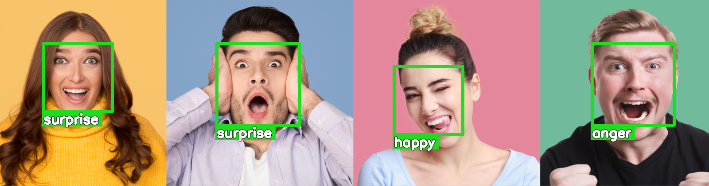

*Дипломная работа*

# Система по распознаванию эмоций

## Материалы для сдачи

### Модель распознавания эмоций

#### Ссылки

1. [Google Colab](https://colab.research.google.com/drive/1N3IJFWkODZLT2IlFsbd75Z9SKlCBCApk?usp=sharing)
1. Копия в формате `*.ipynb`: [16_demo_kaggle_submission_generator.ipynb](16_demo_kaggle_submission_generator.ipynb)
1. Файл [*submission.csv*](submission.csv) для загрузки на kaggle.

#### Содержание

1. Код загрузки тестового датасета.
1. Код загрузки модели для классификации эмоций.
1. Генератор файла *submission.csv*.
1. Тест производительности модели: время инференса и FPS.

#### Инструкция по запуску

* Для запуска необходимо использовать среду Google Colab (рекомендуется) или Jupyter Notebook.
  * При запуске в Jupyter Notebook, возможно, потребуется установить дополнительные зависимости.
* Выполнить все ячейки в ноутбуке (Menu - Runtime - Run all `Ctrl+F9`).
* В процессе работы в текущую директорию будут загружены следующие необходимые для работы скрипта файлы:
  1. `test_kaggle.zip` (220МБ) -- архив с тестовым датасетом
  1. `test_kaggle` (220МБ) -- директория с 5000 тестовых изображений
  1. `saved_model_infr_fer.h5` -- модель в формате HDF5
* По окончании работы скрипта в текущей директории будет создан файл с ответами для загрузки на kaggle:
  * `submission.csv`

### Распознавание эмоций на фото

#### Ссылки

1. [Google Colab](https://colab.research.google.com/drive/1qmD_fJc9KL2pjmWScqWc8aJoXqBiCeFU?usp=sharing)
1. Копия в формате `*.ipynb`: [13_demo_emotion_recognition.ipynb](13_demo_emotion_recognition.ipynb)

#### Содержание

Демонстрация полного пайплайна распознавания лиц на изображении:

1. Детектирование лиц.
1. Определение эмоции с помощью нейросети.
1. Добавление аннотаций в виде бокса (bounding box) и текста.

#### Инструкция по запуску

1. Выполнить все ячейки (Run all `Ctrl+F9`).
1. После выполнения всех ячеек можно заменить тестовые изображения `1.jpg` и `2.jpg` на произвольные и выполнить ячейки начиная с раздела `Demo` (Run after `Ctrl+F10`).

### Модель предсказания valence-arousal разложения

#### Ссылки

1. [Google Colab](https://colab.research.google.com/drive/1ibta6cfO7qeVkVUJtbwR_Fn-usF5x-2L?usp=sharing)
1. Копия в формате `*.ipynb`: [10_demo_valence_arousal.ipynb](10_demo_valence_arousal.ipynb)

#### Содержание

1. Демонстрация предсказания valence-arousal с помощью двух предобученных сверточных нейросетей.
1. Тест производительности моделей: время инференса и FPS.

#### Инструкция по запуску

1. Выполнить все ячейки (Run all `Ctrl+F9`).

### Распознавание эмоций с веб-камеры

#### Ссылки

1. [Google Colab](https://colab.research.google.com/drive/1fBwz0fA1Fn0k8i5EQ9dUgg2Z7TKRkuqc?usp=sharing)

#### Содержание

1. Распознавание эмоций с веб-камеры в режиме реального времени.

#### Инструкция по запуску

1. Убедится, что у веб-браузер имеет доступ к веб-камере (рекомендуется Google Chrome).
1. Открыть ноутбук в [Google Colab](https://colab.research.google.com/drive/1fBwz0fA1Fn0k8i5EQ9dUgg2Z7TKRkuqc?usp=sharing).
1. Выбрать режим GPU (Change runtime type - GPU).
   * Это требование не является обязательным, но в режиме GPU используется более точный (CNN-based) детектор лиц.
1. Выполнить все ячейки (Run all `Ctrl+F9`).
   * Если браузер выдаст запрос -- разрешить доступ к веб-камере.
1. Под последней ячейкой с кодом `run_demo()` должен отобразится видео-поток с веб-камеры.
   * Если видео-поток не отображается, перезапустить ячейку.
1. Рекомендации для корректной работы детектора лиц:
   1. Камера должна снимать в горизонтальном режиме (landscape) с соотношением сторон близким к 4:3 (например 640x480).
   1. Лицо не находится близко к краю кадра и не выходит за его пределы.
   1. Лицо расположено как можно более вертикально (без наклона головы).
   1. Лицо в кадре имеет достаточное освещение.

## Дополнительные материалы

* [Задание](https://github.com/d-01/graduate-2021-dec/wiki/Задание)
* [Описание процесса разработки](https://github.com/d-01/graduate-2021-dec/wiki/Описание-процесса-разработки)
* [Теория](https://github.com/d-01/graduate-2021-dec/wiki/Теория)

